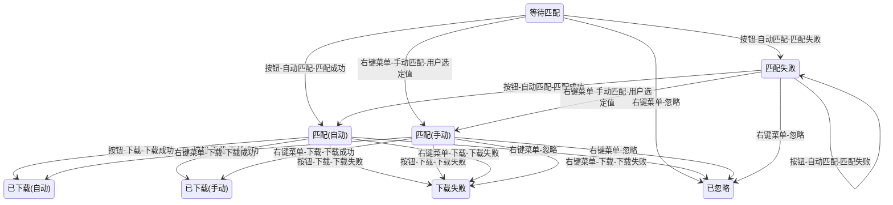

# 音乐状态机

```mermaid
stateDiagram-v2
    state "等待匹配" as match_pending
    state "匹配(自动)" as auto_matched
    state "匹配(手动)" as manual_matched
    state "匹配失败" as match_fail
    state "已下载(自动)" as auto_download_complete
    state "已下载(手动)" as manual_download_complete
    state "下载失败" as download_fail
    state "已忽略" as ignored

    match_pending --> manual_matched : 右键菜单-手动匹配-用户选定值
    match_pending --> auto_matched : 按钮-自动匹配-匹配成功
    match_pending --> match_fail : 按钮-自动匹配-匹配失败

    match_fail --> auto_matched : 按钮-自动匹配-匹配成功
    match_fail --> match_fail : 按钮-自动匹配-匹配失败
    match_fail --> manual_matched : 右键菜单-手动匹配-用户选定值

    auto_matched --> auto_download_complete : 按钮-下载-下载成功
    manual_matched --> auto_download_complete : 按钮-下载-下载成功
    auto_matched --> manual_download_complete : 右键菜单-下载-下载成功
    manual_matched --> manual_download_complete : 右键菜单-下载-下载成功

    auto_matched --> download_fail : 按钮-下载-下载失败
    manual_matched --> download_fail : 按钮-下载-下载失败
    auto_matched --> download_fail : 右键菜单-下载-下载失败
    manual_matched --> download_fail : 右键菜单-下载-下载失败

    match_pending --> ignored: 右键菜单-忽略
    auto_matched --> ignored: 右键菜单-忽略
    manual_matched --> ignored: 右键菜单-忽略
    match_fail --> ignored: 右键菜单-忽略
```

